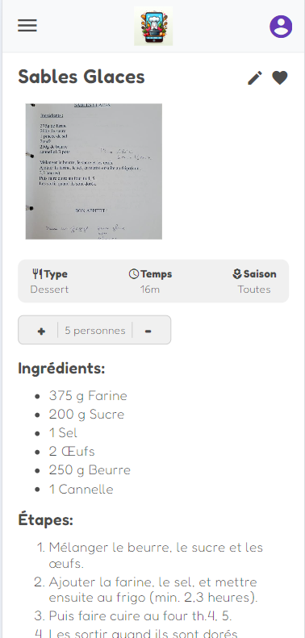

# CookWeApp V1 (frontend)

It is a simple web application to save and share recipes. you can create an account and save your recipes. You can also share your recipes with others. You can also search for recipes by name or by ingredients. You can also see the recipes of other users. You can also like and comment on the recipes of other users.

## Architecture

The application use a [Java Spring Boot backend](https://github.com/quent36987/cook-we) and a postgres SQL. 
I have built a pipeline with GitHub Action to build/test and deploy the project.
I use a cluster with [K3s and argocd to deploy the application.](https://github.com/quent36987/cook-we-config)

## Screenshots

